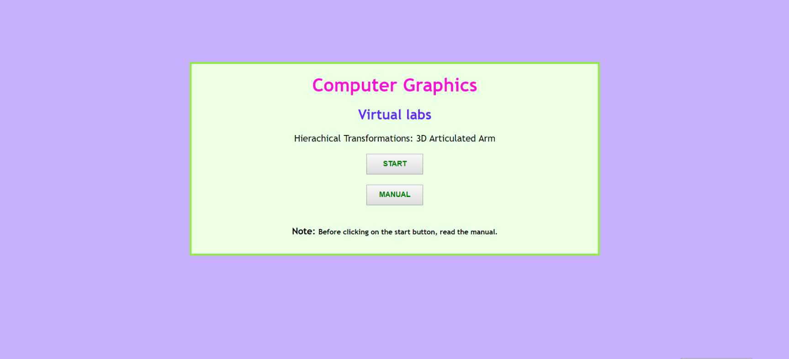
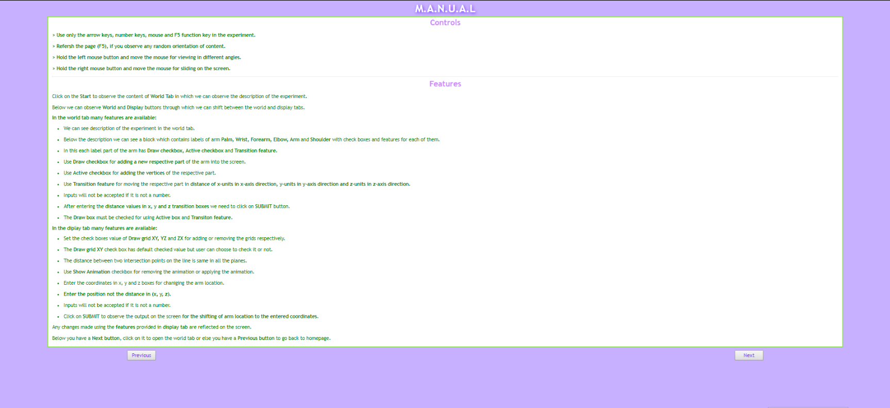
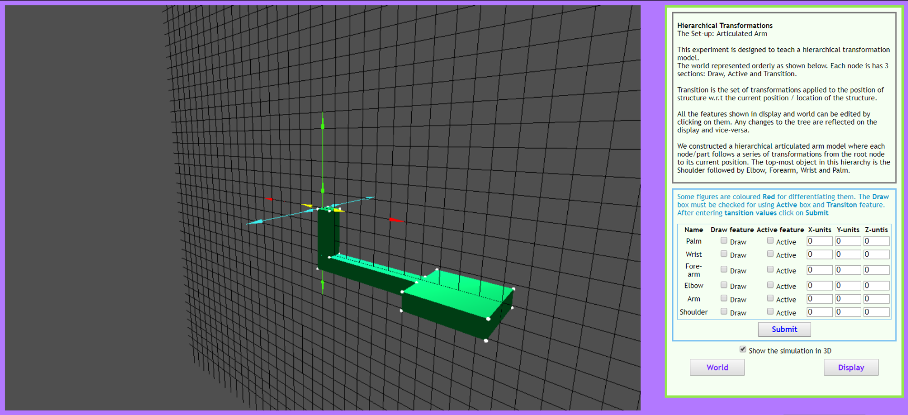
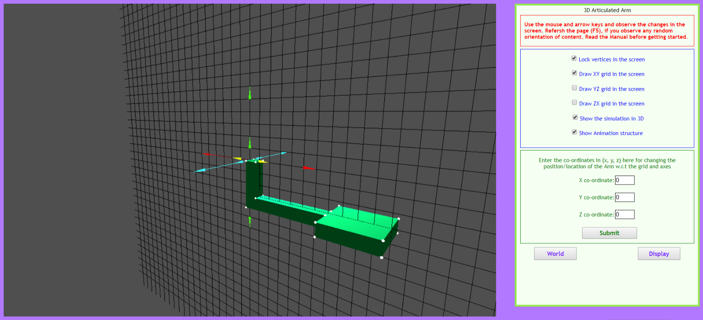

# Experiment Procedure Documentation
---
## Introduction
This document captures the instructions to run the simulation.

## Instructions
1. To start the experiment, open the "index.html" file.

2. To run the experiment, click on the "Start" button provided in the index.html page.

3. Or else click on the "Manual" button for opening the manual and then click on "Next" button for running the experiment.

4. After clicking the "Start" button the "World" tab will be opened with many features.

5. After understanding all the features of the "World" tab using the instructions provided in the "Manual" click on the "Display" button for opening the "Display" tab.

6. After clicking on the "Display" button the "Display" tab will be appearing like shown in the below figure.

7. Understand all the features in the "Display" tab with the help of "Manual" provided. For switching between "World" and "Display" tabs use the "World" and "Display" buttons.
