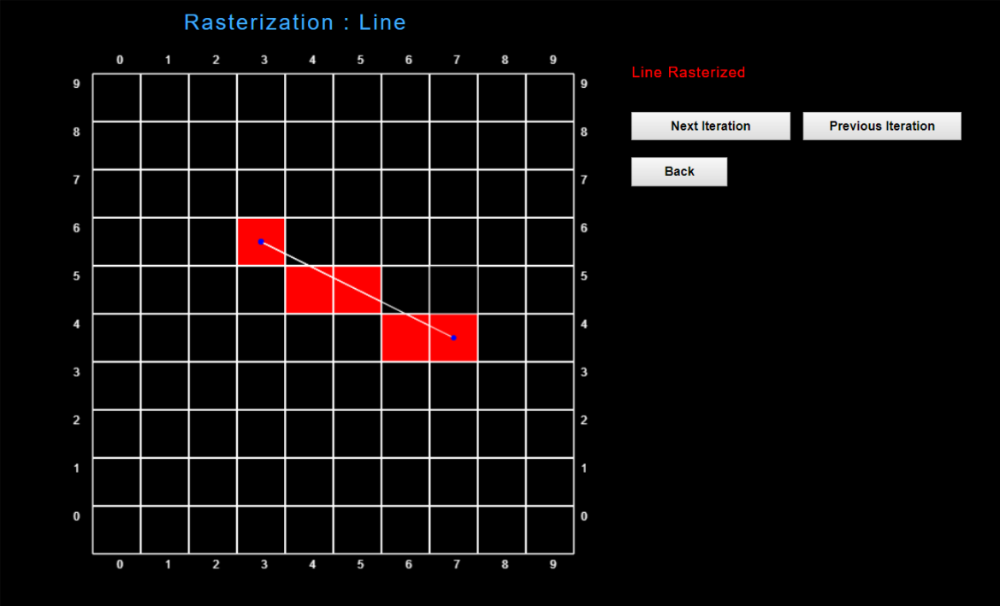

# Experiment Procedure Documentation
---
## Introduction
This document captures the instructions to run the simulation.

## Instructions  
1. To run the experiment, simply run the index.html file by clicking on it and the experiment will open in the browser.

2. To start the experiment of Rasterization : Line, enter the frame width and height and click on "Enter" button or else click on "Start With Default Values" button.

3. If clicked the "Start With Default Values" button then use "Next Iteration" and "Previous Iteration" buttons for performing the experiment or else click on "Back" button to go back.

4. Else if clicked on the "Enter" button after entering the frame height and frame width, then enter the coordinates of 1st and 2d end points of the line.

5. After entering the 1st and 2nd end points coordinates, click on the "Start" button for proceeding further or else click on "Back" button to go back.

6. After clicking on the "Start" button, now use "Next Iteration" and "Previous Iteration" buttons for Rasterizing the line or else click on "Back" button for going back.

